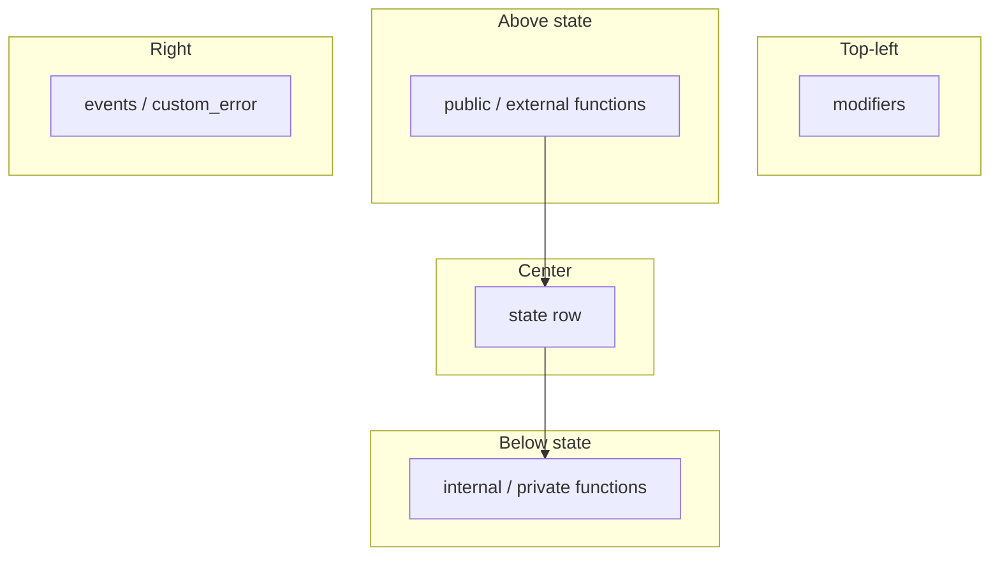

# Implementation Plan: Intra-Contract Graph Layout

**Branch**: `005-intra-compound-layout` | **Spec**: [spec.md](./spec.md)

## Summary

Two-phase layout: **deterministic sandwich grid** inside each contract compound, then **outer** force layout on top-level compounds only. Phases 1-3 (2026-05-24) replace the original tiered vertical stack with a state-centric sandwich and remove inner fcose.

## Sandwich layout (current)

See [contracts/intra-compound-sandwich-layout-v1.md](./contracts/intra-compound-sandwich-layout-v1.md).

## Phase history

| Phase | Delivered |
|-------|-----------|
| MVP | `intraCompoundLayout.ts`, two-phase outer layout, Vitest |
| 1 | State one row; modifiers top-left |
| 2 | Function sandwich; events side; degree-based sub-rows |
| 3 | No inner fcose; entrypoint degree bonus |

## Touch points

| File | Role |
|------|------|
| `frontend/src/graph/intraCompoundLayout.ts` | Grid seeds, sandwich, modifier corner |
| `frontend/src/graph/intraCompoundLayout.test.ts` | Pure layout tests |
| `frontend/src/components/GraphView.tsx` | `applyFullGraphTwoPhaseLayout` on full graph |

## Outer layout (unchanged)

`assignOuterCompoundSeeds` + `cose-bilkent` on parentless `type` / `tile` / external nodes. Children positions fixed after inner grid.

## Testing

- Vitest: `intraCompoundLayout.test.ts` (tiers, sandwich, entrypoint, overlap)
- Manual: `examples/OsTokenRedeemer.sol` full graph after reload
