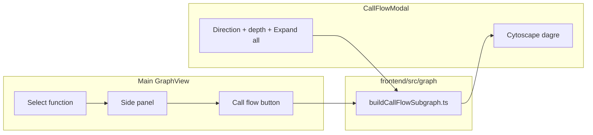

# Implementation Plan: Function Call Flow View

**Spec**: [spec.md](./spec.md)

## Summary

Add a client-side call-flow subgraph builder and a modal Cytoscape view opened from the function details panel. Phased delivery: core BFS subgraph + modal with expand-all + cross_contract_call in P1; cross-link to main graph (P2); export/keyboard (P3).

## Architecture

## Phase 1 (MVP)

| Task area | Files |
|-----------|--------|
| Subgraph pure logic | `frontend/src/graph/buildCallFlowSubgraph.ts`, `.test.ts` |
| Modal component | `frontend/src/components/CallFlowModal.tsx` |
| Wire GraphView | `frontend/src/components/GraphView.tsx` (button, state, pass `displayGraph`) |
| Styles | `frontend/src/styles.css` (`.sg-call-flow-*`) |
| Contract doc | `specs/010-function-call-flow-view/contracts/call-flow-subgraph-v1.md` |

**Default options:** direction=both, depth=2, depthMode=limited, maxNodes=80.

**Expand all:** depthMode=full, direction=both, maxNodes=150 (no per-direction depth limit).

**Default edge kinds:** `function_to_function`, `cross_type_call`, `cross_contract_call`.

**Modal toolbar:** direction radios, depth select (1-4, disabled when expand-all active), **Expand full chain** button, toggle **Show external contract calls** (maps to cross_contract_call).

## Phase 2

- Synthetic/stub node when call edge target is not a function node but cross_contract names a type.
- Highlight root node; click node in modal -> scroll/select on main graph after close.

## Phase 3 (done)

- Export call-flow subgraph as PNG from modal toolbar (`core.png`, scale 2).
- Remember direction, depth, depthMode, showExternalCalls per session (`callFlowSessionPrefs.ts`).

## Out of scope

- Backend subgraph endpoint.
- State reads/writes in call flow canvas.
- Modifier ring compounds inside modal.

## Dependencies

- Spec 007 call direction fix must be deployed in scans used for testing.
- No new npm packages unless `cytoscape-dagre` not already present (check `package.json`).

## Testing

- Vitest: upstream/downstream/both, depth, cap, empty graph, cycle.
- Manual: ImportModifierFixture `updateStateAndDeposit`, cross_type fixture bundle cross-type chain.
